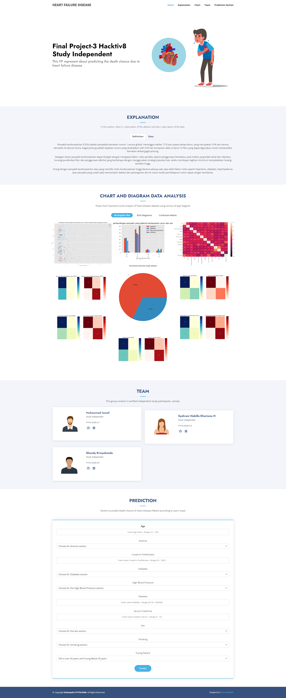
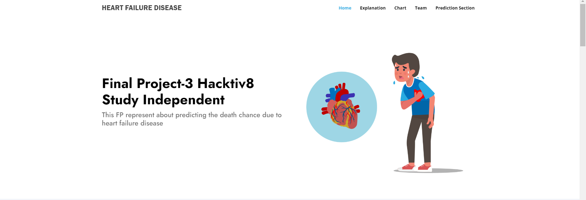
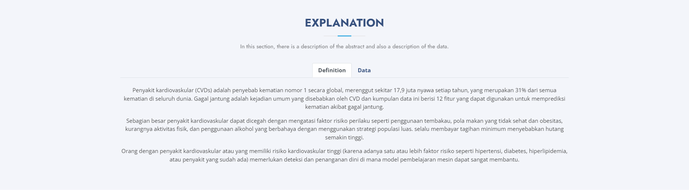
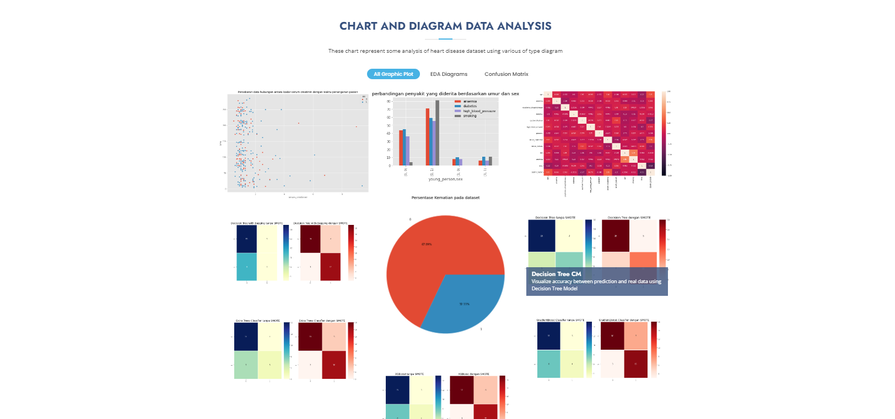
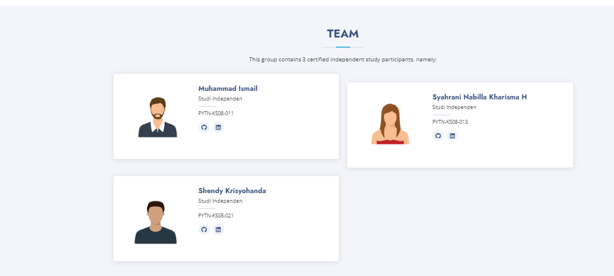
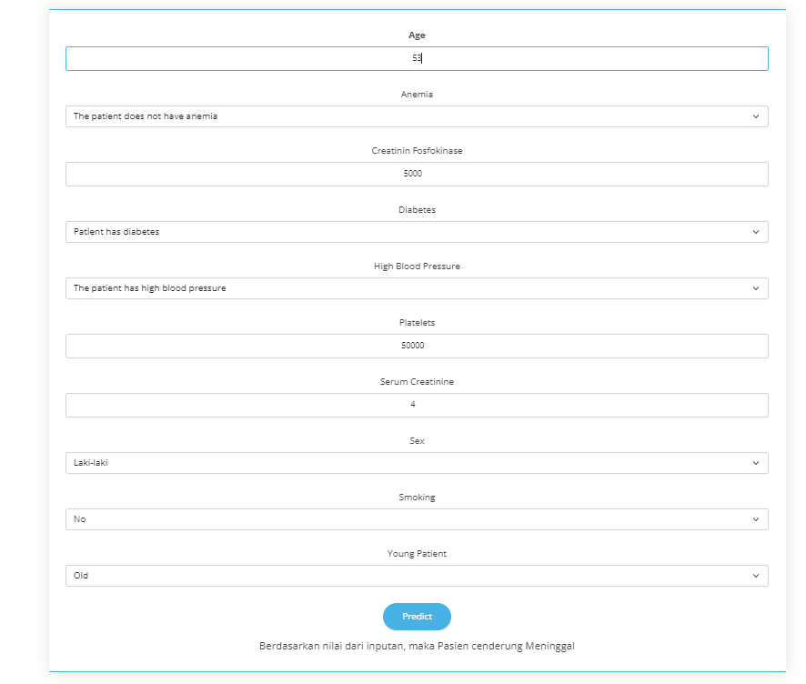

# Final Project 2 - Ensemble

## Latar Belakang  

Penyakit kardiovaskular (CVDs) adalah penyebab kematian nomor 1 secara global, merenggut sekitar 17,9 juta nyawa setiap tahun, yang merupakan 31% dari semua kematian di seluruh dunia.
Gagal jantung adalah kejadian umum yang disebabkan oleh CVD dan kumpulan data ini berisi 12 fitur yang dapat digunakan untuk memprediksi kematian akibat gagal jantung.

Sebagian besar penyakit kardiovaskular dapat dicegah dengan mengatasi faktor risiko perilaku seperti penggunaan tembakau, pola makan yang tidak sehat dan obesitas, kurangnya aktivitas fisik, dan penggunaan alkohol yang berbahaya dengan menggunakan strategi populasi luas.

Orang dengan penyakit kardiovaskular atau yang memiliki risiko kardiovaskular tinggi (karena adanya satu atau lebih faktor risiko seperti hipertensi, diabetes, hiperlipidemia, atau penyakit yang sudah ada) memerlukan deteksi dan penanganan dini di mana model pembelajaran mesin dapat sangat membantu.

Menggunakan Dataset <a href="https://www.kaggle.com/datasets/andrewmvd/heart-failure-clinical-data">Heart Failure Prediction</a>

## Objektif

Final Project 3 ini dibuat guna mengevaluasi konsep Ensemble sebagai berikut:
- Mampu memahami konsep Classification dengan Ensemble Model
- Mampu mempersiapkan data untuk digunakan dalam Ensemble Model
- Mampu mengimplementasikan Ensemble Model untuk membuat prediksi

## Ulasan Proyek

Data ini memiliki 13 atribut. Prediksi keselamatan pasien dari penyakit jantung.

## Informasi Atribut

1. `age` - **umur pasien**
2. `anaemia` - **apakah ada pengurangan haemoglobin**
3. `creatinine_phosphokinase` - **level enzim CPK dalam mcg/L**
4. `diabetes` - **apakah pasien punya riwayat diabetes**
5. `ejection_fraction` - **persentase darah yang meninggalkan jantung dalam persentasi di setiap kontraksi jantung**
6. `high_blood_pressure` - **apakah pasien punya darah tinggi**
7. `platelets` - **jumlah platelet di darah dalam kiloplatelets/mL**
8. `serum_creatinine` - **level serum creatinine di darah dalam mg/dL**
9. `serum_sodium` - **level serum sodium di darah dalam mEq/L**
10. `sex` - **apakah pasien pria atau wanita**
11. `smoking` - **apakah pasien merokok**
12. `time` - **waktu dalam hari untuk follow-up**
13. `DEATH_EVENT` - **apakah pasien sudah meninggal saat waktu follow-up**

## Menjalankan Website 
1. Make Folder `Final Project 3`
2. Make environment variable with command `python -m venv venv` in cmd prompt
3. Download this repository
4. Move folder `model, static, templates` and file `app.py and requirement.txt` into `Final Project 3`
5. Activate environment with `venv/Scripts/activate` with cmd prompt
6. After activated, type this `pip install -r requirements.txt`
7. Type this `$env:FLASK_APP="app.py"` and then `flask run`  

## Tampilan Website

- Tampilan Secara Keseluruhan

- Tampilan Home

- Tampilan Explanation 

- Tampilan Chart

- Tampilan Team

- Tampilan Prediction Section dan Output Prediksi
